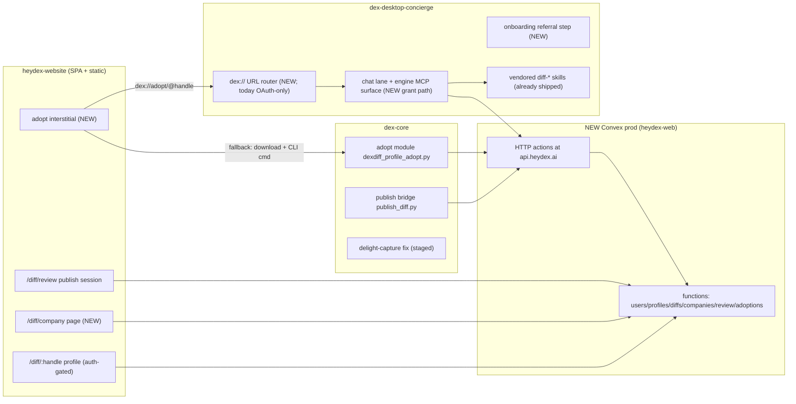

# feat: DexDiff V1 relaunch — company-first

**Target repos:** `heydex-website` (primary — plan lives here), `dex-desktop-concierge` (Phase 3), `dex-core` (skills landing + telemetry fix). Cross-repo units name their repo explicitly; paths are relative to that unit's repo.

---

## Summary

Relaunch DexDiff on top of the existing code as a **colleagues/company-first** platform. End the split-brain backend by giving DexDiff its own dedicated Convex production project; publish Dave's real v2 methodologies under it; prove the share→adopt loop end-to-end once; ship the missing company-page UI with correct privacy semantics; then make adoption and publishing desktop-app moments (no terminal). Public profile viewing, share cards, and OG images are **parked by explicit decision** — the visibility model keeps the `public` tier in place but nothing renders publicly in V1.

---

## Problem Frame

DexDiff's core (methodology-not-files sharing, three-tier visibility, company grouping by email domain, tested adoption plumbing) is built and sound, but the loop has never closed for anyone: the website and the CLI commands talk to two different Convex deployments (`brave-ibex-877` vs `focused-mouse-723`, where `api.heydex.ai` still points), production serves stale v1 one-sentence summaries, the company view has no UI (and a privacy leak in its backend query), and adoption requires a terminal. Dave's sequencing: build supply privately with beta users first (colleagues visibility inside companies), open publicly later.

## Requirements

- **R1** — One dedicated Convex production project for DexDiff; `api.heydex.ai` points at it; the desktop app's backend is untouched. Split-brain ended.
- **R2** — Dave's real v2 methodology YAMLs published under user `davekilleen` with adopt-quality payloads (the ≥5000-char v2 docs, not 227-char v1 summaries).
- **R3** — The share→adopt loop proven end-to-end at least once against the new prod before any beta user touches it.
- **R4** — Nothing publicly viewable in V1: `private` and `colleagues` are the live tiers; `public` remains selectable in schema/UI but no unauthenticated rendering path is enabled (auth gate stays on).
- **R5** — Company surfaces respect the visibility model: only members with visibility ∈ {colleagues, public} appear in any roster or aggregation; private users are never enumerable by colleagues.
- **R6** — A company page UI exists (colleague roster, their published workflows, integrations aggregate) for signed-in verified members of that domain.
- **R7** — A colleague can adopt a workflow from the desktop app with one click from a profile/company link — no terminal.
- **R8** — Desktop onboarding supports a referral entry: "you came from X's profile — start like X?", consent-gated, seed-never-overwrite.
- **R9** — A user can publish their profile from desktop chat (chat → browser review session → publish).
- **R10** — The delight-capture telemetry fix lands so usage evidence starts accumulating (the love-letter engine currently captures nothing).
- **R11** — Quality gates are repeatable: E2E specs cover the colleagues/company behavior, and a CI workflow runs the suite (repo currently has zero CI).
- **R12** — Sign-in is Google-only for the beta (Dave's call). Microsoft/Apple stay configured-off; note the consequence (Microsoft-only companies can't sign in) as accepted V1 scope.

---

## Key Technical Decisions

1. **Build on the existing code — no rebuild** (Dave). All units extend `heydex-website/convex` + SPA, the dex-core funnel branch assets, and the desktop engine's already-vendored skills.
2. **Dedicated Convex project, created by the agent under Dave's logged-in CLI** (Dave delegated). This executes the Option B decision from Build Card `dexdiff-refine-and-beta-testers` and follows the institutional mandate in dex-desktop-concierge `docs/solutions/convex-deployment-per-product.md` (a shared deployment already caused one prod outage: a desktop deploy replaces the entire function set).
3. **Google-only OAuth for beta** (Dave). Only `AUTH_GOOGLE_CLIENT_ID/SECRET` + `@convex-dev/auth` keys on the new deployment; redirect URI printed via `npm run e2e:google:redirect-uri`.
4. **Colleagues-first, public parked** (Dave). The auth gate (`VITE_REQUIRE_AUTH=1`) stays on for `/diff`. The `public` visibility tier stays in schema and UI (it's already there) but no V1 unit builds public rendering, share cards, or OG images.
5. **Company roster shows only opted-in members.** Fix `convex/companies.ts` to filter every enumeration (roster, diffs, integrations, function breakdown) to visibility ∈ {colleagues, public}. Aggregate member count may include private users as a bare number (non-identifying); no other trace of private users. (Flow-analysis finding #1 — this is a privacy bug today.)
6. **`colleagues` requires a company.** Users with no work domain (personal-email domains are already excluded by `GENERIC_DOMAINS`) cannot select `colleagues` — option disabled with an explainer in UI, rejected in backend validation. No silent visible-to-nobody state. (Finding #2.)
7. **Publish is an upsert on (authorId, diffId)**, preserving `adoptionCount` and `publishedAt`, bumping an `updatedAt`. Handles are immutable in V1 (registration claims it once; changes deferred). (Findings #3, #9.)
8. **Desktop adopt rides `dex://` with a web interstitial fallback.** The profile/company page's adopt button hits an interstitial that attempts the deep link and falls back after timeout to download + the existing terminal command. (Finding #5.) The packaged app needs `protocols` declared in electron-builder config — runtime registration alone does not create `CFBundleURLTypes` in Info.plist, so browser-launched `dex://` links do not open the packaged app today.
9. **Chat-lane actions go through an engine-native MCP surface** (the established `tasks-mcp`/`prep-mcp` pattern) rather than widening the chat lane's Bash grant. The chat lane can see the seeded diff-* skills but blocks Bash and writes, so the skills cannot complete network/write actions from chat. A runtime verification task opens Phase 3 before this is locked (see Deferred).
10. **Skills reach users via the desktop vendor pipeline, not ad-hoc bootstrap.** The funnel branch's diff-* skill updates must land on dex-core `main`, then `sync:skills` refreshes `packages/dex-engine/vendor/`. The vendor sync hardcodes the main dex-core checkout path, so work stranded on the funnel branch never reaches the desktop app. **Caveat (doc review):** the merge is NOT purely additive — dex-core main's working tree holds *untracked* copies of several diff-* files that diverge from the funnel branch's committed versions (verified with `diff -rq`); git will refuse the checkout. U15 includes a reconciliation step before the merge.
11. **Deploy order: Convex first, smoke, then frontend, re-smoke** (per `docs/DEPLOYMENT.md` + the build-ship-success-masking learning: verify the *served* artifact, not local exit codes). Extend deploy.sh's existing wrong-deployment tripwire to the new prod URL.

---

## High-Level Technical Design

State: visibility per user `private | colleagues | public` (exists); `colleagues` gate = same `companyId` or domain (exists in `convex/profiles.ts`); company auto-formed from work-email domain, `GENERIC_DOMAINS` excluded (exists in `convex/users.ts`).

---

## Scope Boundaries

**In scope:** everything under Implementation Units below.

**Deferred to Follow-Up Work (explicitly parked, most by Dave's decision):**
- Public profile rendering, share cards, OG images, `?via=` share attribution, SEO/noindex removal — the whole public viral loop.
- Paid "Dex for Teams" tier (org analytics, pushed team packages, IT admin, day-one toolkits) — V1 builds the free company view that creates this audience, not the product.
- Microsoft/Apple sign-in (Google-only beta; Microsoft-only companies accepted as invisible for V1).
- Handle changes / renames (immutable in V1).
- Domain-change / job-change transition story (re-derive on login, memberCount rebalance) — capture as backlog; current beta cohort makes this a non-event.
- Love-letter consent checkbox decoupled from profile visibility (finding #11) — fold into the love-letter revival, not V1.
- "Dex Wrapped" periodic share moments; recommendation engine; compound-intelligence dashboard.
- `docs/KNOWN_DEBT.md` creation (referenced but missing) and broader docs/solutions scaffolding in heydex-website.

---

## Implementation Units

### Phase 1 — Foundation: one backend, real data, loop closed

> **Precondition (whole plan):** Dave registers on the new prod with a **work-domain Google account** (e.g. an heydex.ai / pendo.io mailbox), never a gmail address. `GENERIC_DOMAINS` excludes gmail from company formation, so a gmail registration would leave Dave with no company — the colleagues tier would be untestable and the U5 rehearsal invalid. The U5 second tester must share that same domain.

### U0. Delight-capture telemetry fix (zero-dependency — run any time)

**Goal:** The delight-capture hook actually captures candidates (it has parsed nothing for months — whole-file `JSON.parse` on a JSONL transcript).
**Requirements:** R10
**Dependencies:** none — deliberately split out so evidence collection starts before anything else ships.
**Repo:** dex-core (the fix must land in the *product* hook that ships to users, not only Dave's vault copy — the staged fix at `dex-core-dexdiff-funnel/staging/vault-fixes/delight-capture.cjs` currently reaches only Dave's vault).
**Files:** the shipped hook source in dex-core + wherever the desktop seed pipeline vendors it; apply the same fix to Dave's vault copy.
**Test scenarios:**
- Feed a real-format JSONL transcript containing a positive reaction → candidate captured (the exact case that silently failed).
- Malformed line mid-file → skipped, later lines still parsed.
**Verification:** `delight_candidates.jsonl` appears after a warm session on Dave's machine.

### U1. Create the dedicated Convex production project

**Goal:** A new Convex project (working name `heydex-web`) with the DexDiff schema/functions deployed and env configured, Google-only.
**Requirements:** R1, R12
**Dependencies:** none
**Repo:** heydex-website
**Files:** `.env.local` (local relink), `docs/DEPLOYMENT.md` (record the new deployment names), no schema changes.
**Approach:** Create project under Dave's logged-in `npx convex` CLI; deploy schema + functions; set deployment env: `AUTH_GOOGLE_CLIENT_ID/SECRET`, `@convex-dev/auth` generated keys (`JWT_PRIVATE_KEY`, `JWKS`, `SITE_URL`), `CONVEX_SITE_URL`, `E2E_TEST_SECRET`; `EXA_API_KEY`/`RESEND_API_KEY` when Dave supplies fresh keys (registration works without Exa — LinkedIn auto-fill just stays off). Print the exact Google redirect URI (`scripts/print-google-auth-redirect-uri.sh`) and hand Dave the one console step. Schema already declares legacy auth fields optional (per the per-product learning) — verify before deploy.
**Patterns to follow:** `TEST_SETUP.md` env-key documentation; `docs/solutions/convex-deployment-per-product.md` (dex-desktop-concierge).
**Test scenarios:**
- Fresh deployment: `npx convex run diffs:list` returns empty list, no schema validation errors.
- Google sign-in on the new deployment succeeds end-to-end from `/connect` (dev build pointed at new prod-dev pair); wrong/missing redirect URI produces the documented mismatch error, not a silent hang.
- `E2E_TEST_SECRET`-gated test-harness endpoints respond on the new deployment and refuse without the secret.
**Verification:** New project visible in dashboard; auth round-trip works; harness bootstraps respond.

### U2. Retarget the deploy pipeline and harden its tripwires

**Goal:** `deploy.sh` builds `/diff`+`/connect` against the new prod and refuses to ship a wrong-deployment bundle.
**Requirements:** R1, R11
**Dependencies:** U1
**Repo:** heydex-website
**Files:** `deploy.sh`, `scripts/test-production.sh`, `docs/DEPLOYMENT.md`.
**Approach:** Swap the baked `/diff` build URL from `brave-ibex-877` to the new prod; update the existing tripwire grep to reject both the dev deployment URL and `focused-mouse-723` in the `/diff` bundle (a dev-URL bundle is a silent prod outage — institutional learning); keep `/desktop` build on `focused-mouse-723` untouched. Deploy order stays Convex-first → smoke → frontend → re-smoke. **Set `VITE_AUTH_PROVIDERS=google` in the `/diff`+`/connect` build env** — `ConnectPage.jsx` defaults to rendering all three provider buttons; without this flag Microsoft/Apple buttons appear and dead-end (R12).
**Test scenarios:**
- Tripwire: a bundle deliberately built with the dev URL aborts the deploy with a clear message (rehearse once in dry-run).
- `test-production.sh` passes against the deployed result; served `/diff/` HTML carries the correct `<base href>` and references the new prod URL.
- Deployed `/connect` shows only the Google button.
**Verification:** One full deploy to the VPS with green smoke; `/desktop` untouched (byte-check its bundle).

### U3. Register Dave and seed the real v2 methodologies

**Goal:** User `davekilleen` exists on the new prod with the 8 curated v2 YAMLs published, visibility `colleagues` (nothing public), legacy v1 rows never created.
**Requirements:** R2, R4
**Dependencies:** U1
**Repo:** heydex-website
**Files:** `seed-data/dave-profile-v2/` (exists — verify freshness against the vault), `scripts/reseed-v2.cjs` (exists), `convex/seedV2.ts` (exists).
**Approach:** Dave signs in via Google on the new prod and claims handle `davekilleen` (constraint: `seedProfileDiff` never creates users). Then run the existing pipeline: `npm run db:seed -- --prod --set-visibility colleagues` with the double confirmation env. Validation gates already enforce v2 quality (sha manifest, `dexdiff_schema: "2.0"`, ≥5000 chars, no path leaks). Fresh prod = no legacy `dave` rows to archive, but run `--archive-legacy dave` defensively if any exist.
**Test scenarios:**
- Dry-run first: all 8 YAMLs pass validation; report lists exactly the expected diffIds.
- Post-seed: `GET /api/profile-bundle?handle=davekilleen` (via harness or authorized path) returns contract `2026-04-10` with full-length methodologies; anonymous/other-company access returns not-found (colleagues gate).
- Re-running the seed upserts (no duplicate rows, `adoptionCount` preserved).
**Verification:** Bundle endpoint returns adopt-quality payloads; the June review's "Break 3: payload quality" is dead.

### U4. Rebind api.heydex.ai and verify every consumer

> **Order note (doc review):** U4 executes **after** U5's rehearsal passes. Rehearsing against the new prod before the rebind uses the funnel CLI's API-base override (`DEXDIFF_API_BASE` / the CLI's base-URL env — verify the exact variable in `publish_diff.py`/`adopt_profile.py` as U5's first step) pointed at the new deployment's `.convex.site` URL. This way the live domain only switches once the loop is proven, and a failed rehearsal costs nothing.

**Goal:** `api.heydex.ai` serves the new prod's HTTP actions; all hardcoded consumers work unchanged.
**Requirements:** R1
**Dependencies:** U1, U3, U5 (rehearsal green first)
**Repo:** heydex-website (+ Convex dashboard + Cloudflare, Dave-assisted)
**Files:** none in-repo (Caddy is not involved — `docs/DEPLOYMENT.md:27-30`); `ops/` docs note only.
**Approach:** Custom-domain rebind in the Convex dashboard (Dave's passkey) + Cloudflare DNS if prompted. Consumers to verify: `install-diff.sh`, `scripts/test-production-api.sh` (run with `E2E_ALLOW_LIVE_API_SMOKE=1` from an allowed network — Cloudflare 1010 blocks dev-machine probes), and the dex-core funnel CLI (`publish_diff.py`, `adopt_profile.py`). The desktop backend (`focused-mouse-723`) loses the domain — confirm nothing desktop-side references `api.heydex.ai` (June audit says it serves stale v1 DexDiff data there; the desktop app itself does not consume it).
**Test scenarios:**
- `GET https://api.heydex.ai/api/diffs` returns the new prod's data (colleagues-gated: anonymous sees empty, not stale v1 rows).
- Funnel CLI `link --code` + `publish` round-trip against the rebound domain.
- Desktop app boots and syncs normally after rebind (its Convex URL is baked, not domain-routed — verify, don't assume).
**Verification:** Old deployment receives zero api.heydex.ai traffic; smoke scripts green.

### U5. Close the loop once, for real (rehearsal gate — runs BEFORE U4)

**Goal:** One human other than the author completes publish→review→publish→adopt against the new prod before the live domain switches and before any beta invite goes out.
**Requirements:** R3
**Dependencies:** U1–U3 (rehearses against the new prod's direct `.convex.site` URL via the CLI's API-base override; U4 rebinds only after this passes)
**Repo:** cross (dex-core funnel CLI + heydex-website)
**Files:** none (rehearsal); findings feed follow-up fixes.
**Approach:** Fresh vault on a second machine (or `dex-tester` throwaway profile): run `/diff-adopt-profile @davekilleen` via the standalone `adopt_profile.py` path; separately run one `publish_diff.py` publish under a second Google account with a second handle **at the same work domain as Dave's registration** (see Phase 1 precondition) — which also exercises the colleagues gate for real. First step: confirm the CLI's base-URL override mechanism and point it at the new deployment. This is the June review's non-negotiable clean-machine rehearsal; nobody has ever completed the flow.
**Test scenarios:** (manual rehearsal checklist, not automated)
- Adopt: bundle fetch → validation → files written → adoption log present → `diff-list` sees it.
- Publish: link code → browser review session → edit → publish with `colleagues` → second account at same domain sees it; account at different domain does not.
- Record every friction point as issues; blocking ones fix before beta.
**Verification:** Adoption count increments on the adopted diff; both directions of the loop have happened at least once.

---

### Phase 2 — Colleagues & company (the beta surface)

### U6. Fix the company-view privacy leak and the no-company guard

**Goal:** Company aggregations only ever expose opted-in members; `colleagues` is unselectable without a company.
**Requirements:** R5, R4
**Dependencies:** U1 (deployable backend)
**Repo:** heydex-website
**Files:** `convex/companies.ts`, `convex/users.ts` (setVisibility validation), `convex/review.ts` (updateVisibility/publish validation), `src/pages/MyProfilePage.jsx`, `src/pages/ReviewPage.jsx` (disable + explainer), `convex/testHarness.ts` (seed helpers for multi-user domains), `tests/e2e/company-privacy.spec.ts` (new).
**Approach:** In `myCompany`, filter roster, diffs, integrations map, and function breakdown to users with effective visibility ∈ {colleagues, public}; keep `memberCount` as the raw aggregate number (non-identifying). Backend-reject `colleagues` in `setVisibility`/review publish when the user has no `companyId`/work domain; UI disables the option card with copy explaining why (personal email → no company). **Public-tier honesty (doc review):** the `public` option currently carries a "Recommended" badge in `MyProfilePage.jsx` while nothing renders publicly in V1 — remove the badge and mark the option "coming soon" (selectable, stored, but explained as not yet visible outside sign-in); make `colleagues` the recommended default copy.
**Test scenarios:**
- Seed domain with 3 users: private, colleagues, public → `myCompany` roster/integrations contain exactly the latter two; memberCount = 3.
- Private user's published diffs do not appear in company diff list.
- Personal-email user: `setVisibility('colleagues')` rejected server-side with typed error; UI shows disabled state.
- User at a different domain calling `myCompany` never receives the first domain's data.
- Visibility UI: no "Recommended" badge on `public`; "coming soon" treatment renders on both MyProfilePage and ReviewPage.
**Verification:** New e2e spec green; manual check that a private profile is invisible to a same-domain colleague everywhere (profile page AND company page).

### U7. Company page UI

**Goal:** Signed-in members see "How people at {Company} use Dex" — roster, published workflows, integrations — with a single-member empty state.
**Requirements:** R6
**Dependencies:** U6
**Repo:** heydex-website
**Files:** `src/pages/CompanyPage.jsx` (new), `src/App.jsx` (route `/diff/company`), `tests/e2e/company-page.spec.ts` (new); reuse Nightfall components from `DiffPage.jsx`/`PublicProfilePage.jsx`; retire or redirect the static `diff/company/index.html` marketing copy into the page's empty state (watch deploy.sh `STATIC_SUBDIRS` — remove `company` from the static list so the SPA owns the route; mind the route-precedence rules in `docs/ROUTES.md`).
**Approach:** Render `api.companies.myCompany`. Empty/small states per flow finding #10: 1 member → invite-colleagues framing (no surveillance vibe); roster and integration detail unlocked at ≥2 visible members. Keep the "For teams and leadership" upsell teaser from the static page as a footer block (it seeds the Teams tier narrative). **Discoverability (doc review):** the page needs an entry point — add a "See how {Company} uses Dex" link/CTA on the signed-in profile pages (`MyProfilePage`, colleague profile view) so the route isn't reachable only by typing the URL.
**Test scenarios:**
- No company (personal email) → page explains and offers nothing sensitive.
- 1 visible member → invite empty state, no integration matrix.
- ≥2 visible members → roster, workflows with adoption counts, integrations aggregate render.
- Deep link from a colleague's workflow card routes to their (colleagues-gated) profile page.
**Verification:** e2e spec green; route precedence verified on deployed host (static dir removed, SPA serves).

### U8. Publish semantics hardening

**Goal:** Publishing is idempotent and identity is stable.
**Requirements:** R2, R3
**Dependencies:** U1
**Repo:** heydex-website
**Files:** `convex/review.ts` (publishFromSession upsert), `convex/users.ts` (handle immutability guard), `tests/e2e/` (extend `cli-browser-roundtrip.spec.ts`).
**Approach:** Upsert on (authorId, diffId) preserving `adoptionCount`/`publishedAt`, bump `updatedAt` (finding #9); registration rejects handle changes once claimed (finding #3, V1 rule); confirm review-session TTL + resume behavior already covered by `review-session-expired.spec.ts` still holds on the new prod.
**Test scenarios:**
- Publish same diffId twice with edits → one row, updated content, counts preserved.
- Attempt handle change post-registration → typed rejection.
- Expired session → re-running publish creates a fresh session; drafts not duplicated.
**Verification:** Extended e2e green.

### U9. CI + colleagues E2E battery

**Goal:** The repo gets its first CI; the new behavior is regression-guarded.
**Requirements:** R11
**Dependencies:** U6–U8
**Repo:** heydex-website
**Files:** `.github/workflows/ci.yml` (new), `tests/e2e/` (specs from U6–U8), `TEST_SETUP.md` (document CI env).
**Approach:** Workflow: install → **`npx convex deploy` to the test deployment first** (doc review: without this the suite exercises stale functions and passes against code that isn't what's shipping) → build (tripwire runs) → Playwright e2e against the dev deployment (`brave-ibex-877` stays as the dev/test deployment) with `E2E_TEST_SECRET` + `CONVEX_DEPLOY_KEY` from repo secrets. Exclude live-Google specs (`testIgnore` already does). Heed the e2e-leaked-apps learning from the desktop repo: fixture-level cleanup, red runs must fail loudly. **Accepted asymmetry (doc review):** CI tests the dev deployment, not the new prod — same code deployed to both, and `deploy.sh`'s smoke + `test-production.sh` cover prod at ship time; don't let this drift into a second split-brain (both deployments must always run the same commit's functions).
**Test scenarios:** Test expectation: the workflow itself is the test — one green run on a PR, one deliberate red (failing spec) proving failure is visible.
**Verification:** Badge/status visible on PRs; suite runs < 10 min.

---

### Phase 3 — Desktop moments (adopt + publish without a terminal)

### U10. `dex://` deep-link infrastructure in the desktop app

**Goal:** Browser-launched `dex://` URLs open the packaged app and route beyond OAuth.
**Requirements:** R7
**Dependencies:** none (parallel to Phase 2)
**Repo:** dex-desktop-concierge
**Files:** `package.json` (`build.protocols` — missing today, so packaged apps get no `CFBundleURLTypes`), `main.js` (URL router in front of `handleOAuthDeepLink`; cold-start handling — URL arriving before window exists; today non-OAuth URLs are silently dropped), new IPC channel to renderer, `tests/e2e/deeplink.spec.js` (new).
**Approach:** Add `protocols: [{name: "Dex", schemes: ["dex"]}]` to electron-builder config; route by URL shape: `dex://oauth/...` → existing handler, `dex://adopt/<handle>` → adopt entry (U12), unknown → log + ignore. Buffer a cold-start URL until the renderer signals ready (mirror `get-onboarding-status` IPC pattern). Institutional learnings apply: capture state at bind time; wrap post-entry UI in error boundaries; E2E must exercise the real entry path, not a localMode bypass (the oauth-crash learning's meta-lesson).
**Execution note:** Verify on a packaged build, not just dev — Launch Services registration only exists in the packaged Info.plist.
**Test scenarios:**
- Warm app: `open "dex://adopt/davekilleen"` routes to the adopt entry with the handle parsed.
- Cold start: same URL launches the app and the entry fires after ready.
- OAuth URLs still resolve pending auth (regression).
- Malformed/unknown dex:// URL: no crash, logged, ignored.
**Verification:** Packaged DMG on a clean machine opens from a browser link.

### U11. Adopt interstitial on the web + fallback

**Goal:** "Open in Dex" from profile/company pages, with a graceful no-app fallback.
**Requirements:** R7
**Dependencies:** U10 (deep link), U7 (company page)
**Repo:** heydex-website
**Files:** `src/pages/PublicProfilePage.jsx`, `src/pages/CompanyPage.jsx` (adopt buttons), `src/components/AdoptInterstitial.jsx` (new), e2e spec.
**Approach:** Button attempts `dex://adopt/<handle>` (or `<handle>/<diffId>`); after timeout with no blur/visibility change, fall back to: download DMG + copy-able terminal command (the standalone `adopt_profile.py` path that already ships with the skill). Auth-gated pages only (R4) — the interstitial never renders outside a signed-in colleague context in V1. (Flow finding #5.) **Copy caveat (doc review):** the browser cannot distinguish "no app installed" from "user dismissed the OS open-in-app dialog" — write the fallback copy to serve both cases ("Didn't open? …") rather than asserting the app is missing.
**Test scenarios:**
- With app: link fires, page detects departure, shows "opened in Dex".
- Without app: timeout → fallback panel with download + command.
- The command shown matches the viewer's target (handle/diffId).
**Verification:** Manual on machines with and without the app; e2e covers render states.

### U12. Chat adopt completion path (verify, then build)

**Goal:** The adopt flow actually completes inside desktop chat: guided adopt with live preview against the user's real vault.
**Requirements:** R7
**Dependencies:** U10
**Repo:** dex-desktop-concierge (engine)
**Files:** `packages/dex-engine/` (new MCP surface or tool-grant change — see decision), `packages/dex-engine/runners.js` (allow-list), renderer chat entry (deep link → prefilled chat turn), tests per engine conventions.
**Approach:** **First task is a runtime verification** (deferred decision from planning): can the chat lane's `claude -p` with current `--allowedTools` invoke the seeded diff-adopt skill AND complete its network/write steps? Expected no (Bash blocked). Then implement KTD 9: an engine-native MCP surface exposing `dexdiff_fetch_bundle` / `dexdiff_write_adoption` (wrapping the tested `dexdiff_profile_adopt.py` contract: fetch → validate → write + adoption log), added to the chat allow-list exactly like `tasks-mcp`/`prep-mcp` — instead of widening Bash. The conversational adapt/preview steps stay with the skill; deterministic fetch/write goes through the MCP tools. Adoption count increments only on completion (finding #12); mid-flow unpublish handled per finding #6 (snapshot at start, complete locally with a note, no count write).
**Test scenarios:**
- Deep link → chat opens with the adopt flow initiated for the right handle.
- Happy path: bundle fetched, preview shown against real vault data, user confirms, files written, adoption log present, `diff-list` sees it, count incremented server-side.
- Author unpublished mid-flow: flow completes locally with "no longer listed" note; no count write.
- Network failure: typed error surfaced in chat, no partial writes.
**Verification:** A real adoption completed entirely in the installed app by a non-author account.

### U13. Onboarding referral step — "start like X"

**Goal:** A fresh install that arrived via someone's profile offers their setup during onboarding.
**Requirements:** R8
**Dependencies:** U10 (payload path), U12 (adopt mechanics)
**Repo:** dex-desktop-concierge
**Files:** `app/src/lib/onboardingFlow.ts` (+ its test), `app/src/components/Onboarding.tsx`, `main.js` (referral payload from cold-start deep link → IPC, mirroring `get-onboarding-status`), `tests/e2e/onboarding.spec.js`.
**Approach:** New optional step after `welcome` (which already collects name/role/company — pre-fill from referral where sane). House style is binding: honest detection, consent-gated, show-what-will-be-written, seed-never-overwrite. If the app was installed without a referral, the step never renders. Full adopt executes via U12's path after onboarding completes (don't block onboarding on a long adopt).
**Test scenarios:**
- With referral payload: step renders with the referrer's name/workflows; accept → adopt queued/run post-onboarding; decline → normal flow, no residue.
- Without payload: step absent (union + nextStep covered by unit tests).
- Referral for an unpublished/invisible profile: step degrades to normal flow with a soft note.
**Verification:** Unit tests green; one manual fresh-install run with a referral link.

### U14. Publish-from-desktop chat

**Goal:** "Publish my profile" works as a chat moment: Dex drafts from the vault, browser review opens, user publishes there.
**Requirements:** R9
**Dependencies:** U12 (MCP surface pattern), U4 (api domain)
**Repo:** dex-desktop-concierge (engine) + dex-core (skill content)
**Files:** engine MCP surface (extend U12's: `dexdiff_link`, `dexdiff_create_review_session` wrapping `publish_diff.py`'s contract), chat skill trigger; browser opens the existing `/diff/review/?session=` page.
**Approach:** Reuse the terminal bridge's session flow verbatim server-side (`/api/connect/redeem`, `/api/review/create`) — the human still approves in the browser review page (unchanged trust posture: nothing publishes without explicit review). The generation step is the existing `/diff-generate` skill conversation in chat.
**Test scenarios:**
- Chat "publish my profile" → link flow (first time) → review session created → browser opens to editable drafts.
- Publish with `colleagues` from that session → visible to same-domain account, invisible cross-domain.
- Auth token expiry (30-day rule) → clean re-link prompt, not a silent failure.
**Verification:** One real publish initiated from chat, completed in browser, verified via company page.

### U15. Land the skills in dex-core main; refresh the vendor snapshot

**Goal:** The funnel branch's assets reach the places users actually get them. (Telemetry moved to U0.)
**Requirements:** Distribution correctness for R7–R9
**Dependencies:** U4 (endpoints final before skills land), U12 (any skill-text changes from the MCP split)
**Repo:** dex-core, then dex-desktop-concierge
**Files:** dex-core: merge `dexdiff-funnel` branch's `.claude/skills/diff-*`, `core/dexdiff_profile_adopt.py` + tests, `docs/dexdiff-runtime-boundary.md`, `core/paths.py` keys. Desktop: run `scripts/sync-dex-core-skills.mjs`, commit refreshed `packages/dex-engine/vendor/`.
**Approach:** **Step 1 — reconciliation (doc review):** dex-core main's working tree contains untracked diff-* copies that diverge from the funnel branch's committed versions; diff each pair, keep the newer/correct content (funnel branch is expected authoritative but verify per-file), remove or commit the untracked copies so the merge can proceed cleanly. **Step 2:** merge to dex-core main through its normal CI gates (this also finally puts the DexDiff surface on a remote — today it exists only on one laptop plus a bundle backup). **Step 3:** vendor-sync so new installs seed current skills. Note: seed-never-overwrite means existing vaults keep old copies — acceptable for a zero-tester beta; new beta installs get current.
**Test scenarios:**
- Reconciliation: `git status` clean of diff-* untracked files before merge; no content silently lost (diff review recorded in the PR description).
- dex-core test suite green post-merge (27 existing dexdiff tests).
- Vendor manifest drift check passes post-sync.
**Verification:** Fresh desktop install seeds the updated skills; funnel branch content is on the GitHub remote.

---

## Risks & Dependencies

| Risk | Impact | Mitigation |
|---|---|---|
| Convex custom-domain rebind needs Dave's dashboard passkey + possible Cloudflare step; probes from dev machines are Cloudflare-blocked | Phase 1 stall | Schedule U4 as a paired 15-min session with Dave; verify via `E2E_ALLOW_LIVE_API_SMOKE` from an allowed network |
| Packaged-app `dex://` registration is unproven (no prior art in any repo) | Phase 3 slip | U10 verifies on a packaged build early; interstitial fallback (U11) means adopt never hard-fails |
| Chat-lane tool grants may block more than expected | U12 rework | Runtime verification is U12's first task; MCP-surface pattern is proven (`tasks-mcp`) |
| dex-core main merge collides with its release train / CI battery | U15 delay | Assets are additive; merge via PR with full gates; distribution to *desktop* users doesn't block Phases 1–2 |
| Google-only sign-in hides Microsoft-shop companies | Beta coverage | Accepted V1 cut (R12); Microsoft OAuth on backlog, wiring already exists in `convex/auth.ts` |
| Two Dave-dependent inputs: Google redirect URI allowlist, fresh Exa key | Minor | Exa is optional (manual profile fill works); redirect URI is a 2-min console step in U1 |

## Open Questions (deferred to implementation)

- Exact MCP tool names/surface split for U12/U14 — after the runtime verification.
- Whether `memberCount` shows raw total or visible-only count on the company page — decide with real copy in U7 (privacy floor is fixed either way).
- Review-session TTL tuning (finding #8) — existing expired-session spec defines current behavior; adjust only if rehearsal (U5) shows friction.

## Sources & Research

- June 10 end-to-end review (`~/Vault/06-Resources/Dex_Product/DexDiff_EndToEnd_Review_2026-06-10.md`) — break inventory this plan closes.
- Build Card `dexdiff-refine-and-beta-testers` — Option B decision, split-brain root cause.
- Session research 2026-07-05: funnel-branch map, web/backend map + live probes, repo gap-fill (E2E/seed/deep-link/onboarding/chat-lane), flow & edge-case analysis (13 findings; those cited by number are integrated above, the remainder resolved into Scope Boundaries/deferred items), institutional learnings (per-product Convex deployments, OAuth-in-Electron, ship-verification, E2E entry-path realism).
- Doc review 2026-07-05 (5 personas): amendments applied — work-domain registration precondition (U3/U5), `VITE_AUTH_PROVIDERS` (U2), rehearsal-before-rebind reorder (U4/U5), CI deploy step + backend note (U9), U15 reconciliation step, telemetry split into U0, public-tier UI treatment (U6), company-page nav (U7).
- Viral prior-art research (Wrapped/Wordle/Lovable/Figma/Readme.skill) — shapes the parked public loop, not V1 units.
